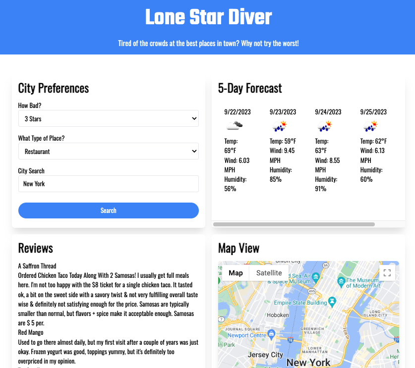

# Lone Star Diver

## Description

This website uses server side APIs, javascript, CSS, and HTML to provide the user with destinations based upon search criteria.

The search criteria includes the star rating, the type of destination, and the intended city. When the search button is clicked, a map of the city, a weather forecast, a list of places, and associated reviews are generated. 

The goal is to provide the user with places that have bad reviews so they can find the "diamonds in the rough" within a city, and not have to worry about large crowds that they'll normally find at the places with 4-5 stars.

## Usage

The Github repository can be found here: https://github.com/dscornaienchi/lone-star-diver 

The website can be found at the URL here: https://dscornaienchi.github.io/lone-star-diver

The website should look like the screenshot below: 

## Credits

APIs from OpenWeather and Google Maps were used in the making of this website. 

Tutorials and instruction provided by the University of Texas at Austin Full Stack Web Developement Program and it's affiliated professors and TA's. 